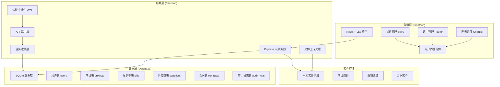
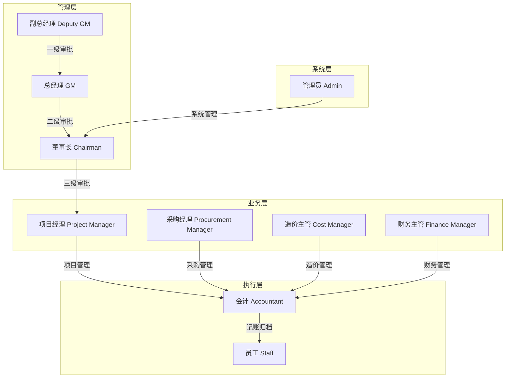
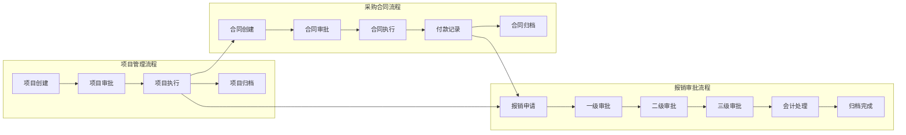
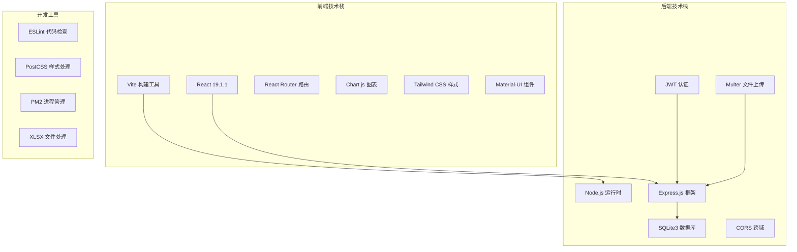
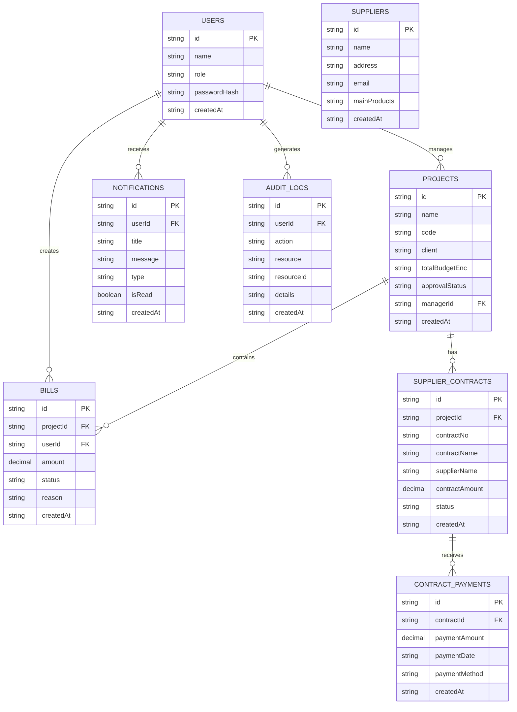
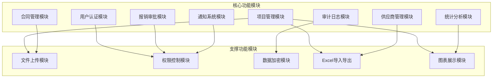
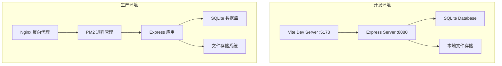
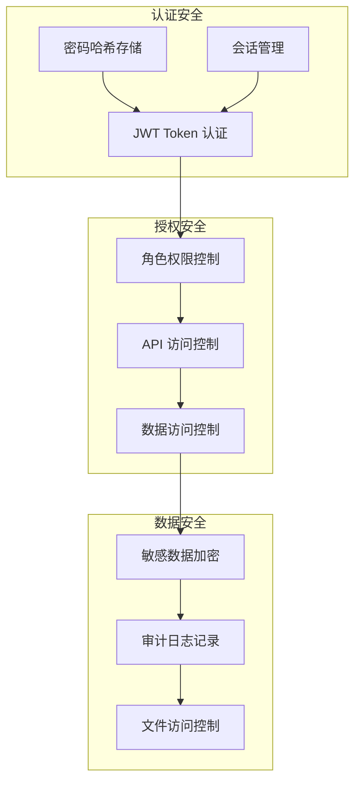

# 华能票据审核系统 - 系统架构图

## 整体架构概览

## 用户角色权限架构

## 业务流程架构

## 技术栈架构

## 数据库架构

## 功能模块架构

## 部署架构

## 安全架构

## 系统特性

### 核心特性
- **多角色权限管理**: 支持8种不同角色的权限控制
- **完整审批流程**: 三级审批制度，支持免审阈值设置
- **项目全生命周期管理**: 从立项到归档的完整流程
- **智能编号生成**: 自动生成符合规则的项目编号
- **实时统计分析**: 动态图表展示项目和财务数据

### 技术特性
- **前后端分离**: React + Express 架构
- **响应式设计**: 支持多种设备访问
- **文件管理**: 支持多种格式文件上传和管理
- **数据导入导出**: Excel 格式数据处理
- **实时通知**: 基于角色的消息通知系统

### 安全特性
- **JWT 认证**: 无状态身份验证
- **数据加密**: 敏感信息加密存储
- **权限控制**: 细粒度的功能权限管理
- **审计追踪**: 完整的操作日志记录